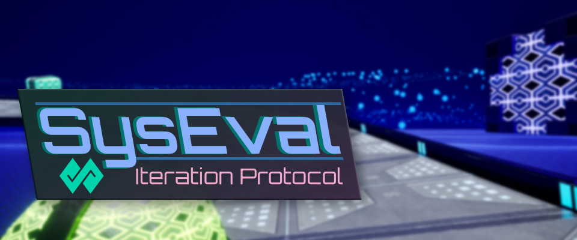
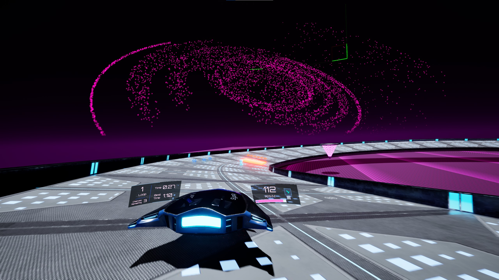
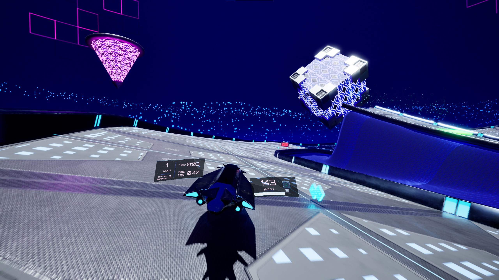
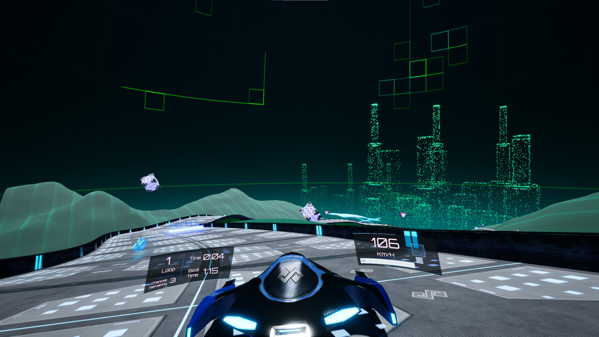
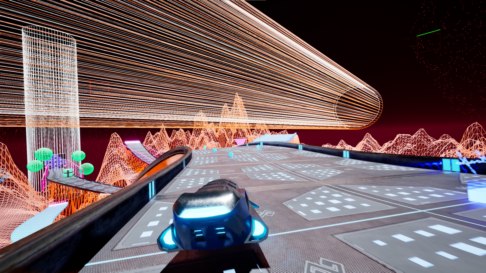
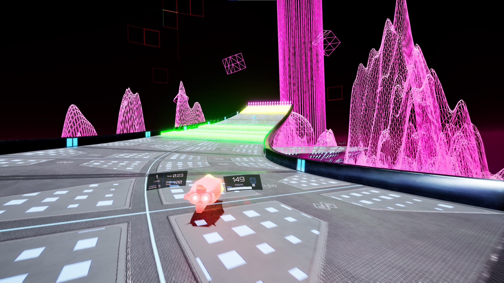
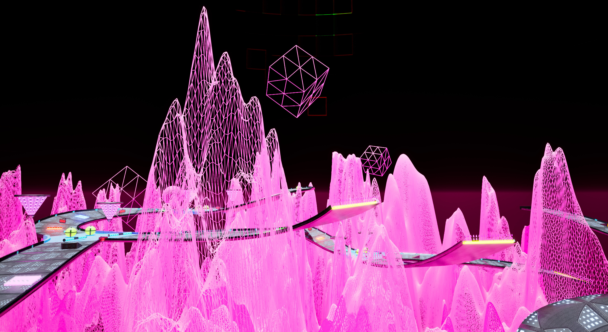
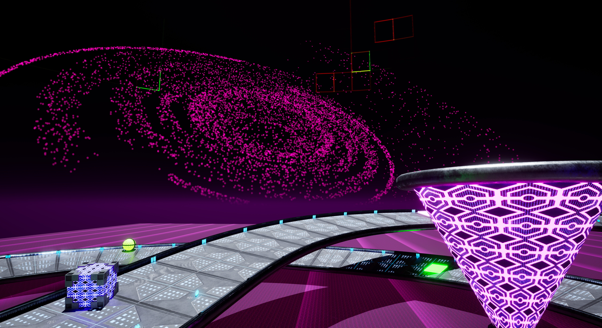

# SysEval: Iteration Protocol

This is the GitHub repo for **SysEval: Iteration Protocol**, a fast paced racing game where you play as SysAI_v4.27, an AI in a training simulation who has to compete against its prior iterations and improve its times to avoid termination!
See our Itch.io page for more details.

Itch.io page: [SysEval: Iteration Protocol](https://cachandlerdev.itch.io/syseval-iteration-protocol)

## Screenshots

## Team

- **Brandon**: Sound Design
- **Chance**: Programming & Voice Acting
- **Christopher**: Programming, Art, & UI
- **Lucas**: Programming & Level Design
- **Mazzledazz**: Art
- **Melonenstrauch**: Music